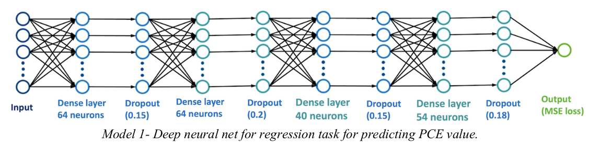
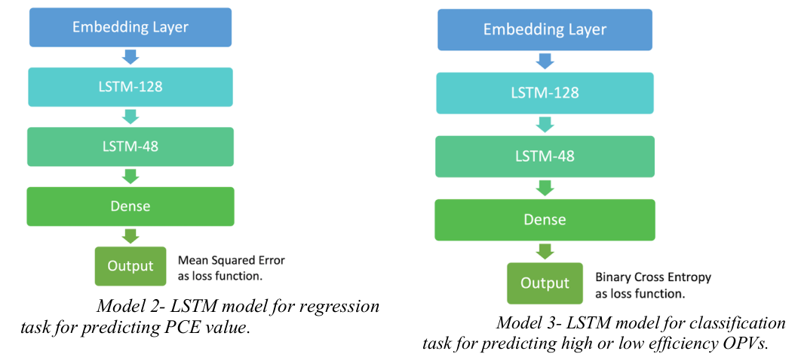

# PCE-prediction-classification-high-performance-OPV-molecules-SMILES
Deep learning based PCE Prediction and Classification of high performance OPV molecules from SMILES.

This repository contains codes for Power Conversion Prediction (PCE) prediction of of High performance Organic PhotoVolatic (OPV) molecules.
This is a tensorflow implementation of a Generic model, and two LSTM models.

## The model architectures:
Model 1 architecture
<table>
  <tr>
    <td> </td>
  </tr>  
</table>

Models 2 and 3 use LSTM for two different tasks:
<itemize>
  <item>PCE prediction</item>
  <item>Classification</item>
</itemize>

<table>
    <tr>
    <td> </td>
  </tr> 
</table>
